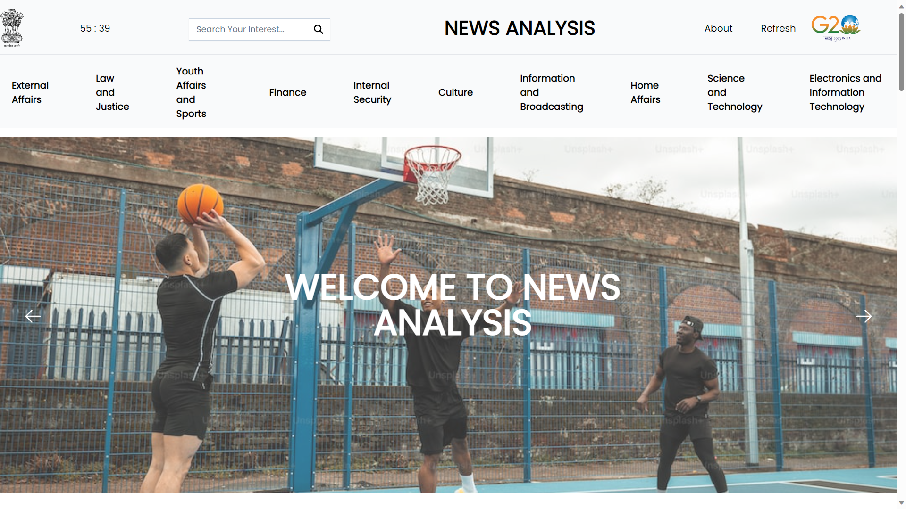
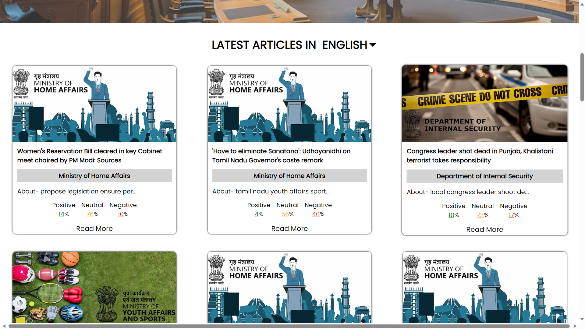
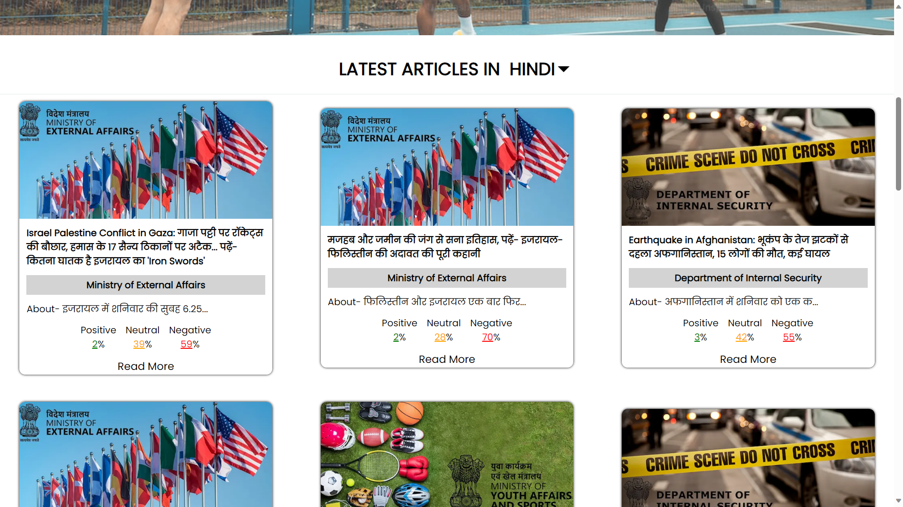

# SIH-2023
## Smart India Hackathon 2023 
## Team Avengers 
## Team Members- 
Akash Rout <br>
Nandini Gera<br>
Sparsh Singh Bhatia<br>
Ujjawal Gupta<br>
Dhruv Goyal<br>
Ankur Gupta<br>

# Project Name: 
## Automated Crawling, Categorization and Sentiment Analysis of Digital News with Incorporated Feedback System. 

## Problem Statement- 1329
The project addresses the need for a 360-degree feedback software for monitoring Government of India-related news stories in regional media using Artificial Intelligence and Machine Learning.

## Solution Proposed
We've developed a smart system that automatically scrapes news from numerous sources across the internet including text articles as well as video news. After fetching these articles, these are then classified into categories of which ministry’s jurisdiction they come under followed by their sentiment analysis as positive, neutral, or negative scores are assigned to each news article fetched. If negative news is detected, alerts are sent to the respective government department through their concerned email address. This system keeps the government updated with news events and allows for quick responses when needed. The news are then displayed on a visually appealing and easy to use user-friendly interface where user can refresh and load the latest news when required. If not refreshed manually, the news is automatically refreshed after every hour. Option to fetch news articles in Engish, Hindi and multiple regional languages has been provided.


## Tech Stack Used
- **AI**: PyTorch, TensorFlow, and BERT libraries for creating ML models.
- **Crawling**: Beautiful Soup, Selenium
- **Server**: Django backend.
- **Frontend**: Next.js and Tailwind CSS frontend.

## Run Commands
To run the project locally:

1. Clone the repository:

```terminal
git clone https://github.com/iamakashrout/SIH-2023.git
```
- Navigate to project directory.
```terminal
cd SIH-2023
```

2. Install dependencies for the client (Next.js):

```terminal
cd client
npm install
```


3. Start the Next.js development server:

```terminal
npm run dev
```

4. Install the necessary libraries and Paste the contents from [here](https://drive.google.com/drive/folders/1ow2Xq4amZnBRtGIQUN-cP-VXTFRaT6ox?usp=sharing) into the server folder. 

5. Start the Django backend server.

```terminal
python manage.py runserver
 ```

## Approach Details
- Crawled 12000+ news articles and videos using Python Beautiful Soup and Selenium Library.<br>
- Applied clustering on these articles to label them into different categories to prepare labeled dataset.<br>
- Trained this dataset of articles using DistilBERT model to generate department predictions. Accuracy - 83%<br>
- Used Roberta model to implement sentiment analysis on news articles.<br>
- Sending mail of Negative News to respective departments using NodeMailer and Gmail - SMTP<br>
- Integrated this model and crawling functionality with a Django backend and wrote APIs for generating predictions and sentiments.<br>
- Merged this backend with a simple and attractive UI where user can give triggers to load latest news articles with their analysis.<br>
- Implemented video news analysis using Selenium library by first extracting audio and converting it into text. Then applied classification and sentiment analysis on the extracted text. <br>
- Developed the same functionalities for news in Hindi and others languages as well using Google Translate API. <br>


## Screenshots
 <br>
<br>
 <br>
<br>
 <br>

[Screenshots Link](https://www.canva.com/design/DAFwxcZCMK8/pz5Z4bYMwfMgdxuzhGVv0g/edit)


## Project Links  

[- Abstract](https://docs.google.com/document/d/16uxjx-_B8r9y3Muj9UF9Te59mdxYftoAy0u3LZxXm_k/edit?usp=sharing)  

[- Description](https://docs.google.com/document/d/1WMexh_AJeoZyrdAbfSyy_lZgD4aRq_PiRC7nJ6Ir4EE/edit?usp=sharing) 

[- Youtube Demo](https://www.youtube.com/watch?v=9pKg_C6C43E) 


